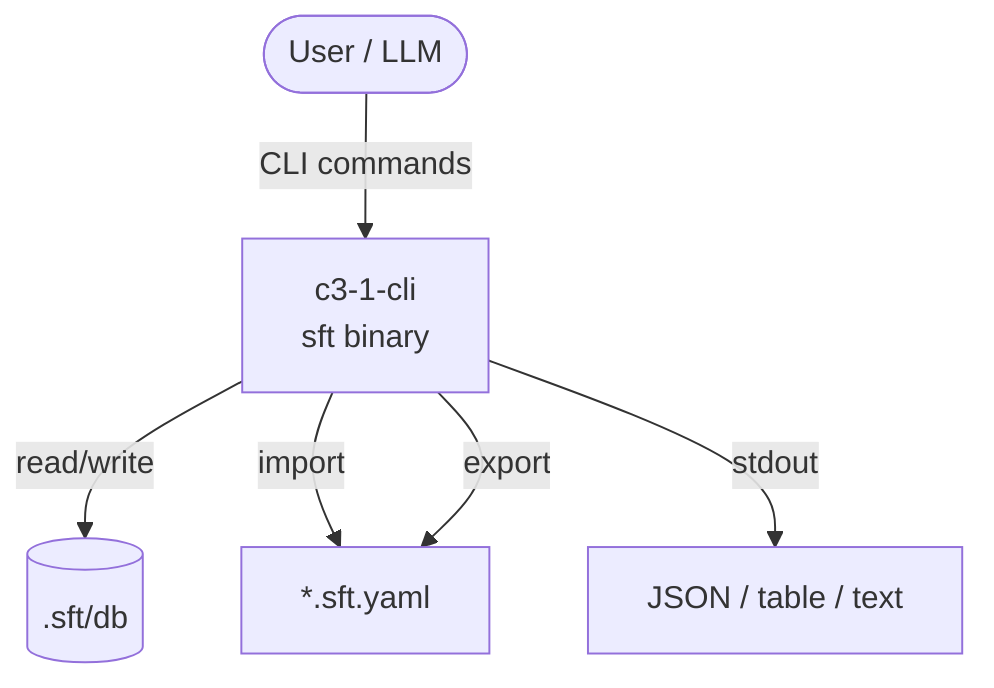

# SFT

## Goal

Provide a lightweight behavioral spec vocabulary for making implicit UI structure explicit — event-driven, layered state machines in YAML.

SFT sits between Figma (visual design) and PRDs (requirements) — a behavioral contract layer that captures what the user sees and does at the screen/region level.

## Abstract Constraints

| Constraint | Rationale | Affected Containers |
|------------|-----------|---------------------|
| Zero external dependencies at runtime | Single static binary, no daemon, no config files required | c3-1-cli |
| YAML round-trip fidelity | import → export must be lossless; specs are the contract between teams | c3-1-cli |
| SQLite as single persistence layer | All state in one file (.sft/db), enables raw SQL queries against spec | c3-1-cli |

## Overview

## Containers

| ID | Name | Boundary | Status | Responsibilities | Goal Contribution |
|----|------|----------|--------|------------------|-------------------|
| c3-1 | cli | app | active | Command dispatch, entity CRUD, YAML I/O, validation, diffing, rendering | The entire product — all spec operations exposed as CLI verbs |
