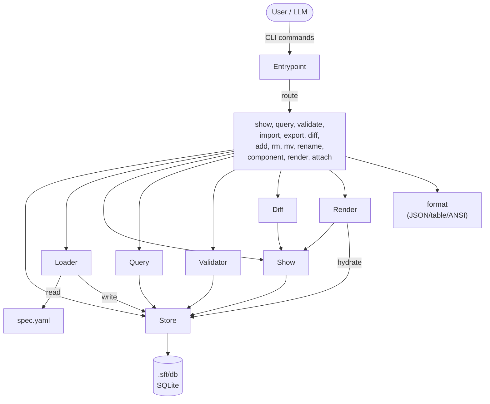

# C3 Architecture Documentation Adoption

## Goal

Adopt C3 methodology for sft.

## Stage 0: Inventory

### Context Discovery

| Arg | Value |
|-----|-------|
| PROJECT | SFT |
| GOAL | Provide a lightweight behavioral spec vocabulary for making implicit UI structure explicit — event-driven, layered state machines in YAML |
| SUMMARY | Go CLI that manages UI behavioral specs (screens, regions, events, state machines, flows, components) in SQLite, with YAML import/export, validation, diffing, and json-render output |

### Abstract Constraints

| Constraint | Rationale | Affected Containers |
|------------|-----------|---------------------|
| Zero external dependencies at runtime | Single static binary, no daemon, no config files required | c3-1-cli |
| YAML round-trip fidelity | import → export must be lossless; specs are the contract between teams | c3-1-cli |
| SQLite as single persistence layer | All state in one file (.sft/db), enables raw SQL queries against spec | c3-1-cli |

### Container Discovery

| N | CONTAINER_NAME | BOUNDARY | GOAL | SUMMARY |
|---|----------------|----------|------|---------|
| 1 | cli | app | Expose all spec operations as a single binary | Go CLI dispatching commands to internal packages, persisting to SQLite |

### Component Discovery (Brief)

| N | NN | COMPONENT_NAME | CATEGORY | GOAL | SUMMARY |
|---|----|----|----------|------|---------|
| 1 | 01 | model | foundation | Define the domain vocabulary | Go structs: App, Screen, Region, Tag, Event, Transition, Flow, FlowStep |
| 1 | 02 | store | foundation | Persist and query all entities | SQLite CRUD, schema, migrations, impact analysis, resolve helpers |
| 1 | 03 | format | foundation | Unified output rendering | JSON/table/ANSI formatting, TTY detection, findings/impact display |
| 1 | 10 | loader | feature | YAML ↔ Store bridge | Parse YAML into store inserts; export Spec tree back to YAML |
| 1 | 11 | show | feature | Assemble spec tree from DB | Load full Spec tree from SQLite, text rendering for `sft show` |
| 1 | 12 | query | feature | Ad-hoc spec inspection | Named queries (screens, events, flows, tags, regions) + raw SQL |
| 1 | 13 | validator | feature | Detect spec inconsistencies | Rule-based validation: orphan events, unreachable states, dangling navigates |
| 1 | 14 | diff | feature | Compare two specs | Produce change list (+/-/~) between current DB and target YAML |
| 1 | 15 | render | feature | Generate json-render output | Build element tree from spec, hydrate with component bindings |
| 1 | 16 | flow | feature | Parse flow sequences | Tokenize arrow notation, classify steps (screen/region/event/action) |
| 1 | 17 | entrypoint | feature | Command dispatch | main.go: flag parsing, command routing, all CLI verbs |

### Ref Discovery

| SLUG | TITLE | GOAL | Scope | Applies To |
|------|-------|------|-------|------------|
| sqlite-persistence | SQLite Persistence | Govern how all data is stored and queried | system | store, query, validator, show |
| yaml-format | YAML Spec Format | Standardize the YAML schema for import/export | system | loader |
| entity-resolution | Entity Resolution | Standardize how names resolve to IDs across entity types | system | store, flow, loader |
| event-model | Event Bubbling Model | Define how events propagate through the hierarchy | system | validator, model, show |

### Overview Diagram

### Gate 0

- [x] Context args filled
- [x] Abstract Constraints identified
- [x] All containers identified with args (including BOUNDARY)
- [x] All components identified (brief) with args and category
- [x] Cross-cutting refs identified
- [x] Overview diagram generated

---

## Stage 1: Details

### Container: c3-1-cli

**Created:** [x] `.c3/c3-1-cli/README.md`

| Type | Component ID | Name | Category | Doc Created |
|------|--------------|------|----------|-------------|
| Internal | c3-101-model | model | foundation | [x] |
| Internal | c3-102-store | store | foundation | [x] |
| Internal | c3-103-format | format | foundation | [x] |
| Internal | c3-110-loader | loader | feature | [x] |
| Internal | c3-111-show | show | feature | [x] |
| Internal | c3-112-query | query | feature | [x] |
| Internal | c3-113-validator | validator | feature | [x] |
| Internal | c3-114-diff | diff | feature | [x] |
| Internal | c3-115-render | render | feature | [x] |
| Internal | c3-116-flow | flow | feature | [x] |
| Internal | c3-117-entrypoint | entrypoint | feature | [x] |

### Refs Created

| Ref ID | Pattern | Doc Created |
|--------|---------|-------------|
| ref-sqlite-persistence | SQLite as sole persistence | [x] |
| ref-yaml-format | YAML spec schema | [x] |
| ref-entity-resolution | Name → ID resolution | [x] |
| ref-event-model | Event bubbling hierarchy | [x] |

### Gate 1

- [x] All container README.md created
- [x] All component docs created
- [x] All refs documented
- [x] No new items discovered

---

## Stage 2: Finalize

### Integrity Checks

| Check | Status |
|-------|--------|
| Context <-> Container (all containers listed in c3-0) | [x] |
| Container <-> Component (all components listed in container README) | [x] |
| Component <-> Component (linkages documented) | [x] |
| * <-> Refs (refs cited correctly) | [x] |

### Gate 2

- [x] All integrity checks pass
- [ ] Run audit

---

## Exit

When Gate 2 complete -> change frontmatter status to `implemented`

## Audit Record

| Phase | Date | Notes |
|-------|------|-------|
| Adopted | 20260317 | Initial C3 structure created |
