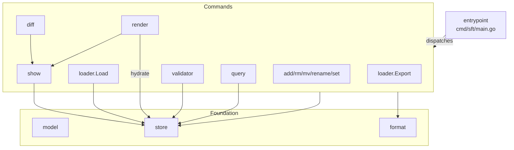

# cli

## Goal

Expose all SFT spec operations as a single static binary — import, query, mutate, validate, diff, render behavioral specs.

## Responsibilities

- Command dispatch and flag parsing for all CLI verbs
- Entity CRUD (apps, screens, regions, events, transitions, tags, flows, components, attachments)
- YAML import/export with round-trip fidelity
- Spec validation with rule-based checks
- Spec diffing between DB and YAML
- json-render output generation
- Dual output: human-readable (ANSI tables) and machine-readable (JSON)

## Complexity Assessment

**Level:** moderate
**Why:** 11 internal packages with clear boundaries, but significant cross-package data flow (Store → Show → Render/Diff/Loader)

## Overview

## Components

| ID | Name | Category | Status | Goal Contribution |
|----|------|----------|--------|-------------------|
| c3-101 | model | foundation | active | Domain types shared by all packages |
| c3-102 | store | foundation | active | SQLite persistence, CRUD, impact analysis |
| c3-103 | format | foundation | active | Unified JSON/table/ANSI output |
| c3-110 | loader | feature | active | YAML ↔ Store bridge |
| c3-111 | show | feature | active | Spec tree assembly + text rendering |
| c3-112 | query | feature | active | Named queries + raw SQL |
| c3-113 | validator | feature | active | Rule-based spec validation |
| c3-114 | diff | feature | active | Spec comparison |
| c3-115 | render | feature | active | json-render output generation |
| c3-116 | flow | feature | active | Flow sequence parsing |
| c3-117 | entrypoint | feature | active | Command dispatch, flag parsing |
